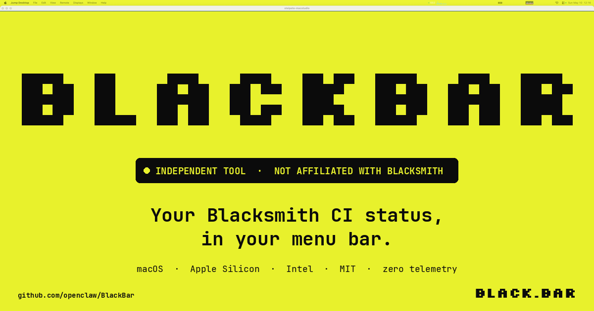

# BlackBar

[](https://github.com/steipete/BlackBar/actions/workflows/ci.yml)
[](https://black.bar)
[](LICENSE)
[](#install)
[](https://black.bar)



> ⚠️  **Independent third-party tool — not affiliated with Blacksmith.** "Blacksmith"
> and the Blacksmith logo are trademarks of their respective owners. BlackBar
> is a personal project that talks to the Blacksmith status feed and dashboard
> the same way your browser does.

A tiny native macOS menu bar app that watches your **Blacksmith CI** runners and
the public **Blacksmith status page** — so you know *before the queue burns*
whether to merge, re-run, or take a walk.

```
  ●  4  ▍▎▏▎▌▏▌▍▎▏▎▌  ⌘
```

That's all it is. A green dot, a vCPU number, a tiny graph. No dock icon. No
electron. No telemetry. No servers in between.

## What it shows

- **Public status** from `status.blacksmith.sh/summary.json` — green when the
  forge is hot, orange when a region's wobbling.
- **Active vCPU** totalled across your live runs (parses runner labels like
  `blacksmith-4vcpu-ubuntu-2404`).
- **Active job count** with the per-job names visible in the dropdown.
- **Platform breakdown** for `amd64`, `arm64`, and `macos` when per-job detail
  isn't available.
- **18-bar history graph** of recent activity, crammed into 54 pixels next to
  the count.
- Right-click either graph in the menu to copy or save a labeled PNG snapshot.

## Install

With Homebrew:

```sh
brew install --cask steipete/tap/blackbar
```

Or grab the latest signed, notarized build:

> Download `BlackBar-<version>.zip` from
> [Releases](https://github.com/steipete/BlackBar/releases/latest), unzip, and
> drag `BlackBar.app` to `/Applications`.

Or build from source:

```sh
git clone https://github.com/steipete/BlackBar.git
cd BlackBar && make app
open build/BlackBar.app
```

BlackBar is a menu bar app — it does not show a Dock icon.

## Login

1. Launch BlackBar.
2. Click the menu bar item.
3. Choose **Login with GitHub**.
4. Complete the regular Blacksmith login in the WebKit window that appears.

The Blacksmith session cookie is stored in the macOS Keychain. After launch
the cookie is cached in memory so polling doesn't keep re-prompting Keychain.
Sign out wipes it.

## Settings

Defaults:

| Setting | Default |
| --- | --- |
| Organization | `openclaw` |
| Repository filter | _(empty — all visible org usage)_ |
| Refresh interval | `60s` |
| Launch at login | Off |

Use **Settings…** from the menu to change the org, an optional repo filter, or
the polling interval. You can also enable launch at login from the General tab.

## How it works

Two endpoints, one Keychain entry, zero proxies.

```
                    ┌──────────────────────────┐
       (no auth) ──▶│  status.blacksmith.sh    │── public status feed
                    └──────────────────────────┘
                                 ▲
                                 │
   ┌───────────────┐             │             ┌──────────────────────────┐
   │  BlackBar.app │─────────────┼────────────▶│  app.blacksmith.sh       │
   │   (menu bar)  │   Keychain  │   cookie    │  (your dashboard)        │
   └───────────────┘             │             └──────────────────────────┘
                                 ▼
                          0 third-party SDKs
                          0 telemetry endpoints
                          0 background sync to anywhere else
```

## Develop

Requirements: macOS 14+, Swift 6 toolchain.

```sh
make build         # swift build -c release
make app           # build + assemble BlackBar.app bundle
make run           # build + open BlackBar.app
make ci            # local CI-equivalent check
```

Source layout:

- `Sources/BlackBar/` — the AppKit app (status item, menu controller, models).
- `Sources/BlackBar/Blacksmith*Client.swift` — the two HTTP clients.
- `Resources/Info.plist` + `Assets/` — bundle metadata and icon.
- `docs/` — the site at [black.bar](https://black.bar).

## Release

BlackBar uses the same Sparkle release shape as the rest of the openclaw
toolchain.

Release wrappers in this repo delegate shared appcast/signing/release logic to
the `release-mac-app` skill in `agent-scripts`. Keep `agent-scripts` next to
this checkout or at `~/Projects/agent-scripts`, or set
`MAC_RELEASE_TOOL=/path/to/mac-release`.

| File | Owns |
| --- | --- |
| `version.env` | `MARKETING_VERSION` and `BUILD_NUMBER` |
| `CHANGELOG.md` | release notes |
| `appcast.xml` | Sparkle feed (signed) |
| `Resources/Info.plist` | Sparkle public EdDSA key (`SUPublicEDKey`) |

Pipeline scripts under `Scripts/`:

- `package_app.sh` — builds the `.app`, embeds Sparkle, writes release metadata.
- `codesign_app.sh` — signs the bundle, nested Sparkle framework, updater, and
  XPC services.
- `sign-and-notarize.sh` — builds, signs, notarizes, staples, zips.
- `release.sh` — tags, publishes the GitHub release, uploads app + dSYM zips,
  updates `appcast.xml`, verifies Sparkle signatures, codesigning, notarization,
  and the signing key's public-key match.
- `verify_appcast.sh` — validates a published appcast entry and downloaded app.
- `sparkle_key_status.sh` — shows the embedded public key and active signing
  key public key without printing private key material.
- `test_live_update.sh` — smoke-tests an update from the previous release.

Required release env:

```sh
export APP_STORE_CONNECT_API_KEY_P8='...'
export APP_STORE_CONNECT_KEY_ID='...'
export APP_STORE_CONNECT_ISSUER_ID='...'
```

Sparkle signing uses the macOS Keychain by default:

- Keychain service: `https://sparkle-project.org`
- Keychain account: `ed25519`
- Item label: `Private key for signing Sparkle updates`
- Public key must match `SUPublicEDKey` in `Resources/Info.plist`

Sparkle keys may be shared by multiple apps. Every app that shares the private
key must embed the same public key. Check the current key without exposing the
private key:

```sh
Scripts/sparkle_key_status.sh
```

`SPARKLE_PRIVATE_KEY_FILE=/path/to/sparkle-ed25519.key` is supported only as an
explicit override. The release scripts reject either Keychain or file keys when
their public key does not match `SUPublicEDKey`.

Cut a release:

```sh
make release
```

Replace the `Unreleased` date in `CHANGELOG.md` with the release date before
running.

## Privacy

BlackBar talks to two hosts only:

1. `status.blacksmith.sh` — public status feed.
2. `app.blacksmith.sh` — your Blacksmith dashboard, with your Blacksmith
   session cookie.

That's the whole network surface. No analytics. No crash reporters. No
"home base" callbacks. The source is right here — read it.

## Trademark notice

"Blacksmith" is a trademark of its respective owner. BlackBar is an
independent third-party tool that interoperates with Blacksmith's public
status feed and signed-in dashboard. It is not affiliated with, sponsored by,
or endorsed by Blacksmith.

If you're the Blacksmith team and you'd rather we change the name, drop a
note at [steipete@gmail.com](mailto:steipete@gmail.com) or open an issue.

## License

[MIT](LICENSE) © Peter Steinberger.
